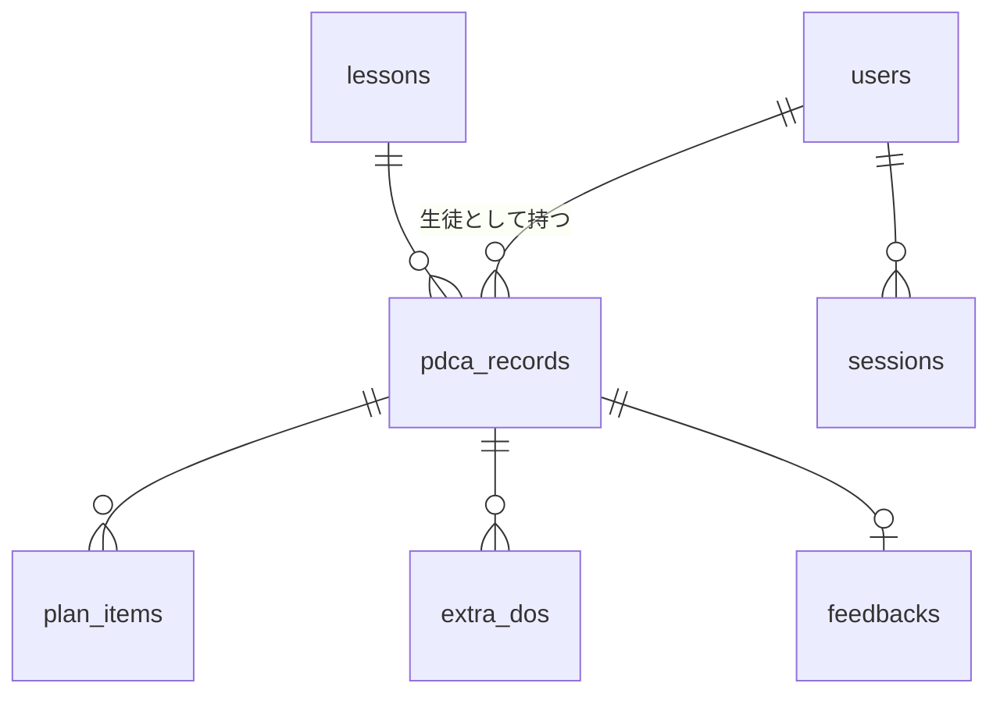

# PDCA Board 仕様書

要件定義書（requirements.md）に基づき、実装に必要な仕様を定める。

## 1. システム構成

```
ブラウザ ──HTTPS──> Cloudflare Workers (TanStack Start)
                        │
                        └── D1 binding ──> Cloudflare D1 (SQLite)
```

- TanStack Start の Server Functions で DB アクセスと認証を行う。
- 画面は SSR + クライアントナビゲーション。
- 環境は `development`（`wrangler dev` + ローカル D1）と `production` の 2 つ。

### 1.1 主要ライブラリ

| 用途 | ライブラリ |
| --- | --- |
| フレームワーク | `@tanstack/react-start`、`@tanstack/react-router` |
| DB アクセス | `drizzle-orm`（D1 ドライバ）、`drizzle-kit` でマイグレーション |
| バリデーション | `zod` |
| パスワードハッシュ | Web Crypto API の PBKDF2（Workers で追加依存なしに動く） |
| UI コンポーネント | shadcn/ui |
| グラフ | shadcn/ui の Chart コンポーネント（内部は `recharts`） |
| スタイル | Tailwind CSS |

### 1.2 UI フレームワークの導入

shadcn/ui はパッケージとして配布されず、コンポーネントのソースをプロジェクトに取り込んで使う。
導入手順は次のとおり。

1. `pnpm dlx shadcn@latest init` で Tailwind CSS と `components.json` を初期化する。スタイルは New York、ベースカラーは Zinc、CSS 変数を有効にする。
2. 必要なコンポーネントを `pnpm dlx shadcn@latest add button input ...` で追加する。`src/components/ui/` に生成される。

TanStack Start は Vite ベースなので、shadcn/ui の Vite 向け手順（`@/` エイリアスの設定と Tailwind の Vite プラグイン）に従う。

### 1.3 画面で使うコンポーネント

| 用途 | コンポーネント |
| --- | --- |
| フォーム入力 | Input、Textarea、RadioGroup、Select、Button |
| 一覧表示 | Table |
| 状態表示 | Badge、Card |
| 確認ダイアログ | AlertDialog |
| 達成率グラフ | Chart（折れ線） |
| ナビゲーション | 上部ナビは Button と Link の組み合わせで自作 |

上記以外のコンポーネントは必要になった時点で追加する。
サンプルとして生徒に見せる際に、装飾よりも構造が伝わることを優先するため、最初から多くを入れない。

## 2. データモデル

### 2.1 ER 図



### 2.2 テーブル定義

**users**

| 列 | 型 | 制約 | 説明 |
| --- | --- | --- | --- |
| id | text | PK | UUID |
| role | text | NOT NULL | `teacher` / `student` |
| email | text | NOT NULL UNIQUE | ログイン ID |
| name | text | NOT NULL | 表示名 |
| password_hash | text | NOT NULL | PBKDF2 ハッシュ（salt 込み文字列） |
| created_at | integer | NOT NULL | Unix 秒 |

**sessions**

| 列 | 型 | 制約 | 説明 |
| --- | --- | --- | --- |
| id | text | PK | ランダム 32 バイトの hex |
| user_id | text | FK users.id ON DELETE CASCADE | |
| expires_at | integer | NOT NULL | Unix 秒。発行から 30 日 |

**lessons**（授業回）

| 列 | 型 | 制約 | 説明 |
| --- | --- | --- | --- |
| id | text | PK | UUID |
| number | integer | NOT NULL UNIQUE | 回番号 |
| date | text | NOT NULL | `YYYY-MM-DD` |
| created_at | integer | NOT NULL | |

**pdca_records**

| 列 | 型 | 制約 | 説明 |
| --- | --- | --- | --- |
| id | text | PK | UUID |
| student_id | text | FK users.id ON DELETE CASCADE | |
| lesson_id | text | FK lessons.id | |
| status | text | NOT NULL | 後述の状態 |
| check_act | text | NULL | 振り返り・次回の課題 |
| achievement_rate | integer | NULL | 0〜100。Do 保存時に再計算して保存 |
| plan_confirmed_at | integer | NULL | |
| created_at | integer | NOT NULL | |
| updated_at | integer | NOT NULL | |

UNIQUE (student_id, lesson_id)。

**plan_items**

| 列 | 型 | 制約 | 説明 |
| --- | --- | --- | --- |
| id | text | PK | UUID |
| record_id | text | FK pdca_records.id ON DELETE CASCADE | |
| position | integer | NOT NULL | 表示順（0 始まり） |
| plan_text | text | NOT NULL | 目標・予定 |
| do_text | text | NULL | 実施内容・結果 |
| do_status | text | NULL | `done` / `partial` / `not_done` |

**extra_dos**（Plan に紐づかない Do）

| 列 | 型 | 制約 | 説明 |
| --- | --- | --- | --- |
| id | text | PK | UUID |
| record_id | text | FK pdca_records.id ON DELETE CASCADE | |
| do_text | text | NOT NULL | |

**feedbacks**

| 列 | 型 | 制約 | 説明 |
| --- | --- | --- | --- |
| record_id | text | PK, FK pdca_records.id ON DELETE CASCADE | 1 レコード 1 件 |
| advice | text | NOT NULL | |
| created_at | integer | NOT NULL | |
| updated_at | integer | NOT NULL | |

### 2.3 レコードの状態遷移

`pdca_records.status` は次の 4 値をとる。

```
planning ──Plan確定──> doing ──Do/Check-Act保存──> reflected ──FB投稿──> closed
```

| 状態 | 意味 | 生徒が編集できるもの |
| --- | --- | --- |
| planning | Plan 入力中（下書き） | Plan 項目 |
| doing | Plan 確定済み、Do 未入力 | Do、追加 Do、Check/Act |
| reflected | Do と Check/Act を保存済み | Do、追加 Do、Check/Act |
| closed | 教員フィードバック済み | なし |

- `doing` から `reflected` への遷移は、全 Plan 項目に do_status が入り、かつ Check/Act が空でないときに行う。
- `reflected` でも Do・Check/Act の再編集は可能。再保存時に達成率を再計算する。
- 教員は `doing` / `reflected` のどちらでもフィードバックを投稿でき、投稿時に `closed` へ遷移する。
- `planning` のレコードにはフィードバックを投稿できない。

### 2.4 達成率の計算

```ts
function calcRate(items: { do_status: 'done' | 'partial' | 'not_done' | null }[]): number {
  if (items.length === 0) return 0
  const score = items.reduce((s, i) =>
    s + (i.do_status === 'done' ? 1 : i.do_status === 'partial' ? 0.5 : 0), 0)
  return Math.round((score / items.length) * 100)
}
```

Do 保存のたびに計算し、`achievement_rate` に保存する。
グラフはこの列を読むだけで描画する。

## 3. 認証と認可

- ログインは Email とパスワード。成功時に `sessions` に行を挿入し、`session` Cookie（HttpOnly、Secure、SameSite=Lax）にセッション ID を入れる。
- 全ルートの `beforeLoad` でセッションを検証し、`role` に応じて `/teacher/*` と `/student/*` へのアクセスを制限する。
- 未ログインは `/login` へリダイレクト。ログイン済みで `/login` を開いた場合は役割に応じたダッシュボードへ。
- 生徒が扱えるレコードは `student_id` が自分のものに限る。Server Function の中で必ず検査する。
- 教員アカウントは `pnpm seed` で作成する。Email とパスワードは環境変数 `SEED_TEACHER_EMAIL` / `SEED_TEACHER_PASSWORD` から読む。

## 4. 画面仕様

### 4.1 ルート一覧

| パス | 役割 | 画面 |
| --- | --- | --- |
| `/login` | 共通 | ログイン |
| `/teacher` | 教員 | ダッシュボード |
| `/teacher/students` | 教員 | 生徒管理 |
| `/teacher/lessons` | 教員 | 授業回管理 |
| `/teacher/records` | 教員 | 記録一覧（授業回選択） |
| `/teacher/records/$recordId` | 教員 | 記録詳細・フィードバック投稿 |
| `/student` | 生徒 | ダッシュボード |
| `/student/records/new` | 生徒 | PDCA 新規追加（Plan 入力） |
| `/student/records/$recordId` | 生徒 | PDCA 詳細（Do・Check/Act 入力、閲覧） |
| `/student/records` | 生徒 | 過去の PDCA 一覧 |
| `/student/settings` | 生徒 | パスワード変更 |

共通レイアウトは左サイドナビゲーション（PC では固定幅の縦並び、スマートフォンでは上部に横並び）。教員と生徒でナビの項目を切り替える。

### 4.2 ログイン

- Email、パスワード、ログインボタン。
- 失敗時は「Email またはパスワードが違います」を表示し、どちらが誤りかは示さない。

### 4.3 教員ダッシュボード

- **直近授業回の提出状況**：日付が今日以前で最新の授業回を対象とする。生徒ごとに次の 4 列を「済 / 未」で表示する。Plan、Do、Check/Act、フィードバック。行クリックで記録詳細へ。レコード未作成の生徒は全列「未」。
- **クラス平均達成率の推移**：横軸を授業回（第 N 回）、縦軸を 0〜100% とする折れ線グラフ。各回の平均は `achievement_rate` が非 NULL のレコードのみで求める。

### 4.4 生徒管理

- 一覧（氏名、Email、登録日）と追加フォーム（氏名、Email、初期パスワード）。
- 行ごとに「編集」「パスワード再設定」「削除」。削除は確認ダイアログを挟む。

### 4.5 授業回管理

- 一覧（回番号、日付、レコード数）と追加フォーム（回番号、日付）。回番号は「最大 + 1」を初期値にする。
- レコード数が 1 以上の授業回は削除ボタンを無効化する。

### 4.6 記録一覧（教員）

- 授業回セレクトで対象を切り替える。初期値は直近授業回。
- 生徒ごとに、状態、達成率、フィードバック有無を表示。行クリックで詳細へ。

### 4.7 記録詳細・フィードバック投稿（教員）

- 生徒名、授業回、状態、達成率。
- Plan 項目ごとに Plan・Do・達成状態を表形式で表示。続けて追加 Do と Check/Act。
- 下部にフィードバック入力欄（テキストエリア）と投稿ボタン。投稿済みなら内容を表示し、修正できる。
- 状態が `planning` のときは入力欄を無効化し、「Plan 確定前のためフィードバックできません」と表示。

### 4.8 生徒ダッシュボード

- **今回の授業**：直近授業回について、自分のレコードの状態を表示し、次の操作へのボタンを 1 つ出す。

| 状態 | 表示 | ボタン |
| --- | --- | --- |
| レコードなし | Plan 未登録 | Plan を登録する |
| planning | Plan 下書き中 | Plan を続ける |
| doing | Do 未入力 | Do を記録する |
| reflected | 入力済み | 内容を確認・修正する |
| closed | フィードバック済み | 内容を確認する |

- **達成率の推移**：自分の `achievement_rate` を授業回順に折れ線グラフで表示。
- **最新のフィードバック**：直近の `closed` レコードのフィードバックと授業回を表示。

### 4.9 PDCA 新規追加（Plan 入力）

- 授業回セレクト。初期値は直近授業回。すでにレコードがある授業回は選べない。
- 上部に「前回の振り返り」として、選択した授業回の直前の回にある自分の Check/Act と教員フィードバックを表示。どちらもなければ「前回の記録はありません」。
- Plan 項目のテキスト入力を複数行並べ、「項目を追加」「削除」で増減する。最低 1 件。
- 「下書き保存」は `planning` のまま保存。「Plan を確定して授業を始める」は空の項目を除いて保存し、`doing` へ遷移する。確定には確認ダイアログを挟む。

### 4.10 PDCA 詳細（生徒）

- 上部に授業回、状態、達成率。
- Plan 項目ごとに、Plan テキスト（読み取り専用）、Do テキストエリア、達成状態のラジオ（達成 / 一部達成 / 未達成）を並べる。
- 「Plan に無かった実施内容」として追加 Do を複数行入力できる。
- Check/Act のテキストエリア。
- 「保存」ボタン。全 Plan 項目に達成状態があり Check/Act が空でなければ `reflected` へ、そうでなければ `doing` のまま部分保存する。
- 状態が `closed` の場合は全項目を読み取り専用にし、末尾に教員フィードバックを表示する。
- 状態が `planning` の場合はこの画面を開かず、新規追加画面へリダイレクトする。

### 4.11 過去の PDCA 一覧（生徒）

- 授業回の降順に、回番号、日付、状態、達成率、フィードバック有無を表示。行クリックで詳細へ。

## 5. Server Functions

すべて `createServerFn` で定義し、入力は zod で検証する。
権限のない呼び出しは 403 を返す。

| 名前 | 権限 | 入力 | 処理 |
| --- | --- | --- | --- |
| `login` | 公開 | email, password | 認証、セッション発行 |
| `logout` | ログイン済 | なし | セッション削除 |
| `changePassword` | 生徒 | current, next | 現パスワード検証後に更新 |
| `listStudents` | 教員 | なし | |
| `createStudent` | 教員 | name, email, password | |
| `updateStudent` | 教員 | id, name, email | |
| `resetStudentPassword` | 教員 | id, password | |
| `deleteStudent` | 教員 | id | レコードも CASCADE 削除 |
| `listLessons` | ログイン済 | なし | |
| `createLesson` / `updateLesson` / `deleteLesson` | 教員 | | レコードがある回の削除は拒否 |
| `getTeacherDashboard` | 教員 | なし | 提出状況と平均達成率の配列 |
| `listRecordsByLesson` | 教員 | lessonId | |
| `getRecord` | 教員 / 本人 | recordId | Plan 項目、追加 Do、フィードバック込み |
| `upsertFeedback` | 教員 | recordId, advice | 投稿時に `closed` へ |
| `getStudentDashboard` | 生徒 | なし | 直近レコード状態、達成率配列、最新 FB |
| `getPreviousReflection` | 生徒 | lessonId | 直前回の Check/Act と FB |
| `savePlanDraft` | 生徒 | lessonId, items[] | `planning` として upsert |
| `confirmPlan` | 生徒 | lessonId, items[] | `doing` へ遷移。空項目除外、1 件以上必須 |
| `saveDo` | 生徒 | recordId, items[{id, doText, doStatus}], extraDos[], checkAct | 達成率再計算。`closed` なら拒否 |
| `listMyRecords` | 生徒 | なし | |

## 6. ディレクトリ構成

```
pdca-board/
├── docs/
│   ├── requirements.md
│   └── specification.md
├── src/
│   ├── routes/            # TanStack Router ファイルベースルート
│   │   ├── __root.tsx
│   │   ├── login.tsx
│   │   ├── teacher/
│   │   └── student/
│   ├── server/
│   │   ├── auth.ts        # セッション、パスワードハッシュ
│   │   ├── db.ts          # drizzle クライアント
│   │   ├── schema.ts      # テーブル定義
│   │   └── fns/           # Server Functions（機能別）
│   ├── lib/
│   │   └── achievement.ts # 達成率計算
│   ├── components/
│   │   ├── ui/            # shadcn/ui から取り込んだコンポーネント
│   │   └── ...            # アプリ固有のコンポーネント
│   └── styles.css         # Tailwind エントリと CSS 変数
├── components.json        # shadcn CLI 設定
├── drizzle/               # マイグレーション SQL
├── scripts/
│   └── seed.ts            # 教員アカウント作成
├── wrangler.jsonc
├── drizzle.config.ts
└── package.json
```

## 7. 環境変数とバインディング

| 名前 | 種別 | 用途 |
| --- | --- | --- |
| `DB` | D1 binding | データベース |
| `SESSION_SECRET` | secret | Cookie 署名用 |
| `SEED_TEACHER_EMAIL` | ローカル env | シード用 |
| `SEED_TEACHER_PASSWORD` | ローカル env | シード用 |

## 8. 開発とデプロイ

```bash
pnpm install
pnpm db:migrate:local   # wrangler d1 migrations apply --local
pnpm seed               # 教員アカウント作成
pnpm dev                # wrangler dev

pnpm db:migrate:remote  # 本番 D1 にマイグレーション適用
pnpm deploy             # wrangler deploy
```

## 9. 実装の順序（授業での提示順）

1. 認証とログイン画面
2. 教員：生徒管理、授業回管理
3. 生徒：Plan 登録と確定
4. 生徒：Do・Check/Act 入力と達成率計算
5. 教員：記録一覧とフィードバック
6. 両ダッシュボード（提出状況、グラフ）

各段階で動くものを見せられるよう、この順に縦に積む。
